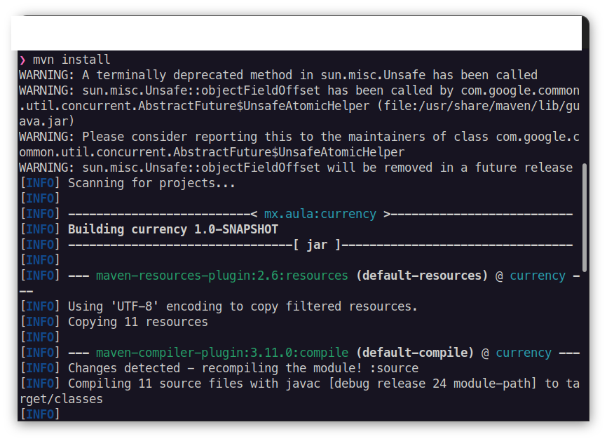
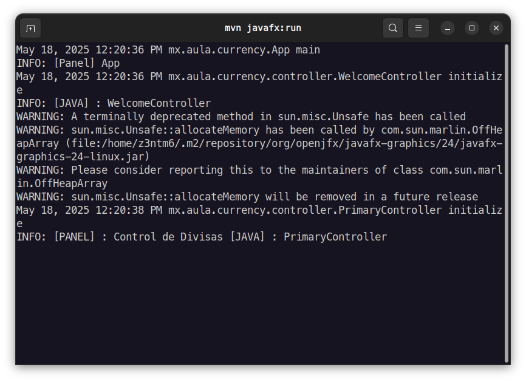
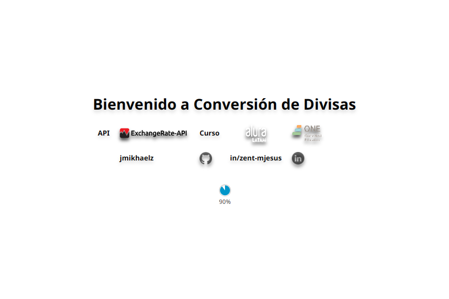
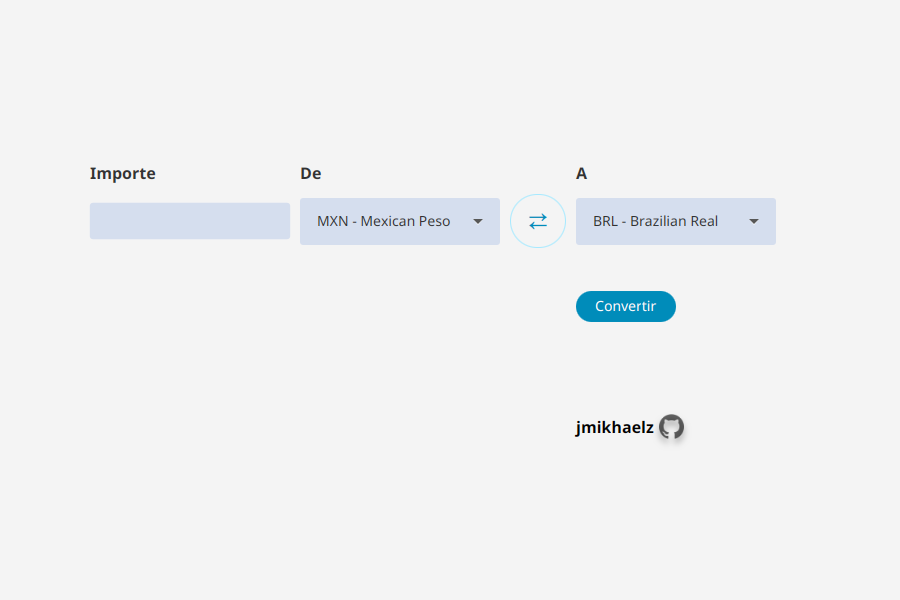
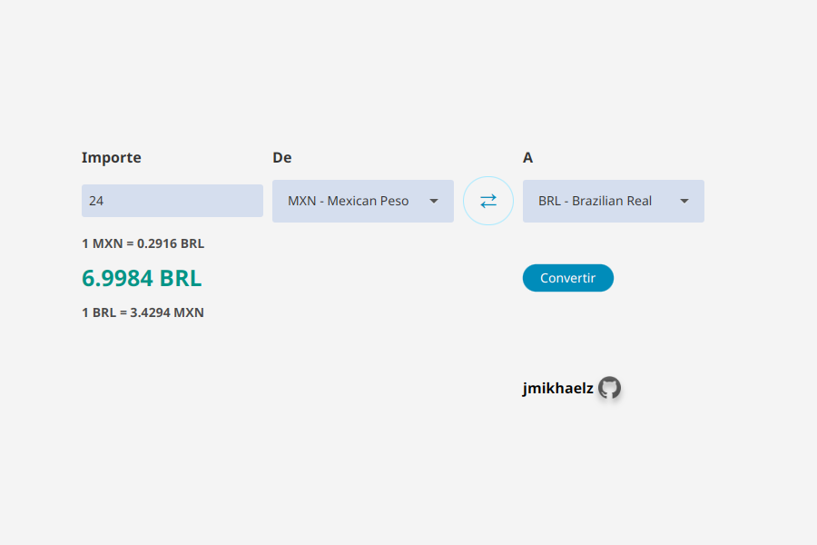
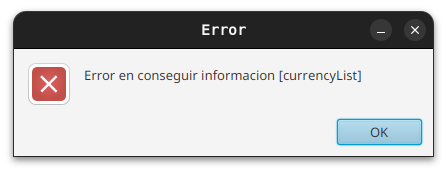
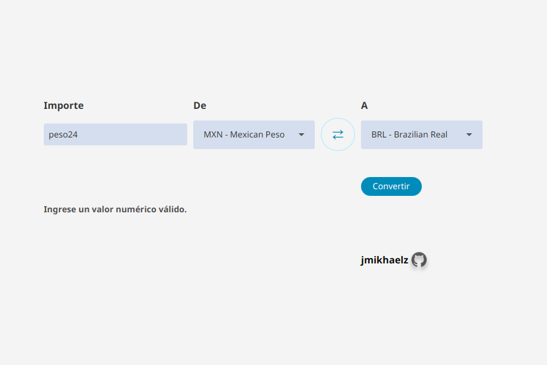

# Currency Exchange Viewer 💱

(curso de Alura-Oracle-2025)

Aplicación de escritorio construida con **JavaFX** y **Maven** que permite consultar tipos de cambio utilizando una API externa. Su objetivo es ofrecer una interfaz visual limpia para mostrar la información de diferentes monedas en tiempo real.

## 🛠️ Tecnologías utilizadas

- Java 24
- JavaFX
- Maven
- FXML (interfaces gráficas)
- Consumo de API REST [Exchange Rate API](https://www.exchangerate-api.com/)
- Patrón MVC (Model-View-Controller)

## 📂 Estructura del proyecto

```sh
❯ tree
.
├── pom.xml
├── README.md
└── src
    └── main
        ├── java
        │   ├── module-info.java
        │   └── mx
        │       └── aula
        │           └── currency
        │               ├── App.java
        │               ├── client
        │               │   └── exchangerateClient.java
        │               ├── controller
        │               │   ├── PrimaryController.java
        │               │   └── WelcomeController.java
        │               ├── models
        │               │   ├── CurrencyCode.java
        │               │   └── InfoChange.java
        │               ├── service
        │               │   ├── ExchangerateServiceImpl.java
        │               │   └── exchangerateService.java
        │               └── util
        │                   ├── CleanTerm.java
        │                   └── ConfigUtils.java
        └── resources
            ├── config.properties
            └── mx
                └── aula
                    └── currency
                        ├── img
                        │   ├── api-icon.png
                        │   ├── aula-icon.png
                        │   ├── course-icon.png
                        │   ├── github-icon.png
                        │   └── linkedin-icon.png
                        ├── PrimaryController.fxml
                        ├── styles
                        │   ├── stylePrimary.css
                        │   └── styleWelcome.css
                        └── WelcomeController.fxml
```

## 🚀 Cómo ejecutar el proyecto

### Pre-requisitos

- JDK 24 instalado
- Maven instalado
- Conexión a internet para consumir la API

### Ejecución

Sigue estos pasos para clonar e instalar el proyecto:
API
 **1.Clona el repositorio a tu máquina local**:

```sh
   git clone https://github.com/jmikhaelz/currencyexch.git 
```

 **2.Entra en la carpeta del proyecto**:

```sh
   cd currencyexch
```

 **3.Ejecucion del proyecto**:

```bash
mvn install

mvn javafx:run
```

### Configuración

Copia el archivo config.properties.example como config.properties y ajusta los valores necesarios (por ejemplo, claves de API si se requieren):

```sh
#Manejo de entorno de KEY_API
exchangerate.key=KEY_API
```

## 🧩 Características principales

- Interfaz gráfica moderna con JavaFX
- Estilos CSS personalizados
- Limpieza y validación de datos de entrada
- Arquitectura modular por paquetes: cliente, controlador, modelo, servicio y utilidades
- Íconos personalizados incluidos en la carpeta img/

## Guía de Uso: Aplicación de Conversión de Divisas

### Consola / Terminal  

(Opcional: Solo si ejecutas sin ayuda de un IDE)

#### Instalación y ejecución

<div style="text-align: center;">
    
    
</div>

---

### Interfaz de Bienvenida  

Este panel es informativo y muestra datos iniciales de la aplicación.

<div style="text-align: center;">
    
</div>

---

### Interfaz de Conversión de Divisas  

#### Pantalla de inicio  

Muestra los campos de selección de monedas y el valor a convertir.  
<div style="text-align: center;">
    
</div>

#### Ingreso del valor a convertir  

Aquí el usuario ingresa la cantidad deseada.  
<div style="text-align: center;">
    
</div>

#### Conversión de moneda  

La aplicación procesa la conversión y muestra el resultado.  
<div style="text-align: center;">
    
</div>

#### Invertir moneda  

El usuario puede hacer clic en el botón (⇄) para intercambiar los valores de moneda origen y destino.  
<div style="text-align: center;">
    
</div>

---

### Manejo de Errores  

#### Error de conexión con la API  

Si la aplicación no logra conectarse al servicio de conversión, se mostrará un mensaje de error.  
<div style="text-align: center;">
    
</div>

#### Error de ingreso de datos  

Si el usuario ingresa un valor que no es numérico, aparecerá una advertencia.  
<div style="text-align: center;">
    
</div>
